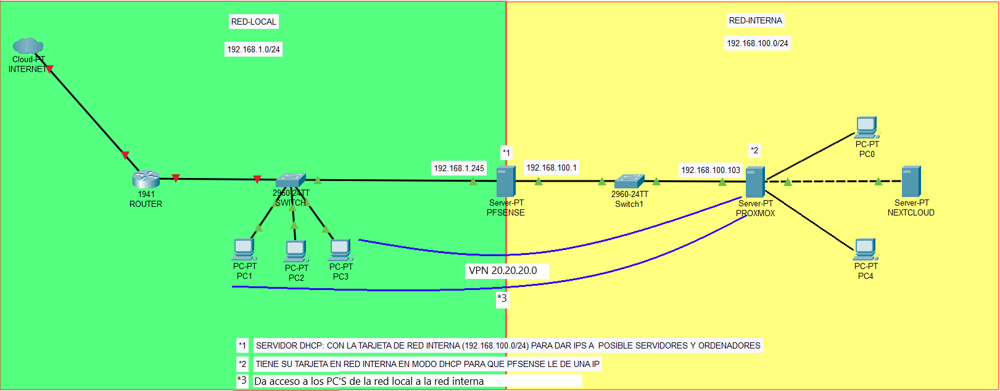

# CONFIGURACIÓN DE RED

### Configuración de la máquina virtual de pfSense:

Asignaremos dos interfaces de red a mi máquina virtual de pfSense. Por ejemplo, para la red interna será "pfsense_lan" y Adaptador Puente para la red externa.
Configura la interfaz "pfsense_lan" como la red interna, se utiliza un rango de direcciones IP privadas, como 192.168.100.0/24.
El adaptador puente estará conectada a mi red física y obtendrá una dirección IP pública.

### Configuración de los clientes (Proxmox y Debian)

Estos tendrán solo una tarjeta de red. La red interna se conectará con la "pfsense_lan" y la máquina pfsense les dará ip del rango de direcciones IP que asignamos antes en la máquina.

### Túnel

El túnel VPN se utiliza para asegurar la comunicación entre los clientes de la red local y los servidores de la red interna. Para que esto sea seguro, se utilizarán certificados SSL y autenticación de usuarios y contraseñas.
 
### Ejemplo Gráfico

-----------------------------------------------------------------------------------------
#### LICENCIA

 Este obra está bajo una <a rel="license" href="http://creativecommons.org/licenses/by-sa/4.0/">licencia de Creative Commons Reconocimiento-CompartirIgual 4.0 Internacional</a>.
