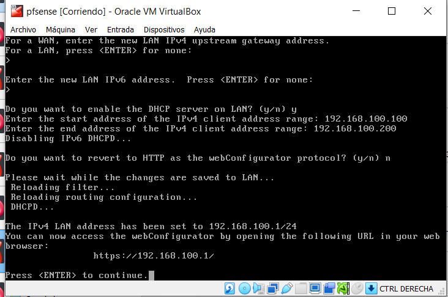
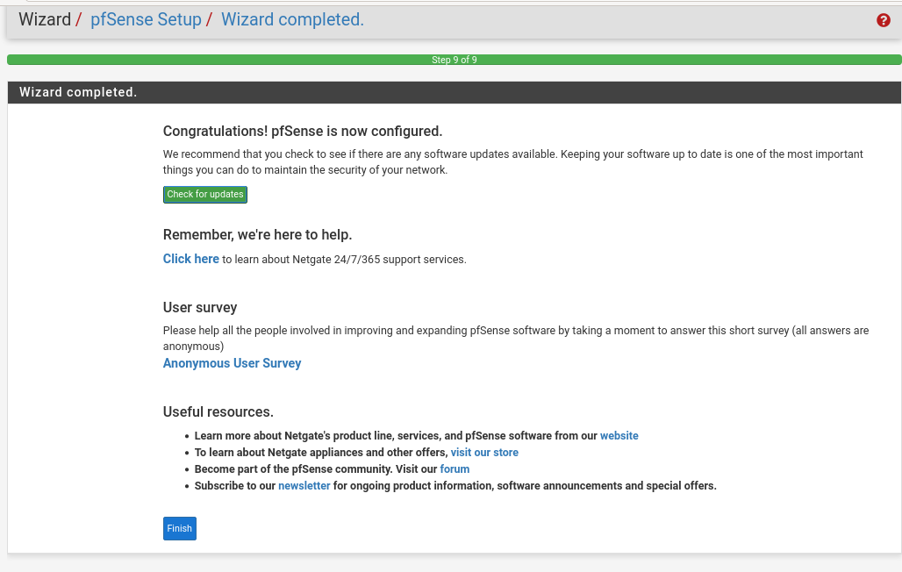

# INSTALACIÓN PFSENSE

Configuramos la máquina como se muestra en la siguiente imagen.

**IMPORTANTE!!**
Tendremos que tener dos adaptadores. El primero será la WAN y es la que sale a internet y el segundo adaptador de red será la LAN y será la red interna, donde podremos conectar con otras máquinas.

Le damos a iniciar la máquina y comenzará la instalación. Dejamos todos los valores por defecto en la instalación.

Cuando acabe de reiniciar nos saldrá este menú.

Elegimos la opción 2, para configurar una ip de la LAN y luego nos pide una máscara de red.

En el siguiente campo lo dejamos vacio al igual que dejamos vacio la ipv6.
Le decimos que si queremos habilitar el DHCP y luego establecemos un rango para que les de a nuestras máquinas virtuales. Por último no queremos revertir de HTTPS a HTTP.

Vemos que nos da una URL.

Vemos que nos da una URL.

Antes de abrir nuestra máquina Debian debemos de comprobar que le tenemos puesta una tarjeta de red interna con el nombre que le pusimos a la red interna de pfSense.

Abrimos nuestra máquina virtual de Debian y comprobamos en configuración de red, que se le ha asignado una ip del rango anterior.

Comprobamos que pueda hacer ping a 8.8.8.8, lo hace correctamente, pero no puede resolver los DNS. Tenemos que hacer que el servidor pueda resolver los DNS y luego configurarlo para que el cliente también pueda.

## CONFIGURACIÓN DE PFSENSE

Para la configuración de pfSense nos tendremos que meter en la url que antes nos dio la máquina virtual de pfsense. Todo esto desde el cliente Debian.

El usuario por defecto es admin y la contraseña pfsense.

Empezaremos con la configuración.

Tendremos que poner un nombre de hostname (pfsense) y como dominio (pfSense.pfsenseasir.lab) 

Ponemos la zona donde nos ubicamos.

Utilizaremos el modo DHCP, pero si fuese para una empresa lo mejor sería una ip estatica.

En la siguiente pantalla verificaremos si la configuración LAN esta correcta.

Pondremos una contraseña para adminitrador.

Y le damos a reiniciar para que se guarden los cambios. Cuando se reinicie nos saldrá una pantalla donde pondra 'finish', le damos.

El servidor ya puede resolver los DNS.

Nos vamos a DNS resolver en el apartado de services. En interfaces de entrada seleccionamos LAN y Localhost. En la interfaz de salida seleccionamos WAN.
Seleccionamos la petición de redireccionamiento de DNS. Seleccionamos las opciones para los registros DHCP.

Guardamos y dentro de DNS resolver en el apartado de services, nos vamos a configuración avanzada. Nos vamos directamente al apartado de Advanced Resolver Options.
Aquí pondrems el Message Cache Size a 512 MB, esto será para almacenar los mensajes caché como bien dice el nombre.

Guardamos y aplicamos los cambios. 

Nos vamos al DHCP server en servicios y comprobamos el rango que pusimos anteriormente. Esto se comprueba porque puede ser que en el servidor pfSense hayamos un establecido un rango y en esta configuración no se haya establecido del todo, no pasa nada, lo ponemos como queremos o lo dejamos tal cuál no afectará.

Un poco más abajo en other options, habilitamos la opción para el formato de tiempo y para mostrar la gráfica de estadísticas.

Nos vamos a las reglas de firewall. Quitaremos la regla de ipv6. 

Ahora haremos una limpieza en los registros en Status -> System logs -> Settings y añadiremos varias opciones.

Seleccionamos la siguiente casilla para mostrar los registros de forma que esten los registros nuevos arribas y el nº de entrada de registros lo ponemos en 30.

Nos vamos de nuevo al firewall y editamos la regla de IPV4 LAN NET, habilitando la casilla para que nos muestre todos los registros de paquete de datos.

Le damos al botón donde nos dice Advanced options y nos vamos al apartado TCP Flags y marcamos ANY Flags, para utilizar todos los TCP Flags (son los indicadores específicos que se establecen en el encabezado de un paquete TCP, por ejemplo, SYN, ACK, etc).

Ahora comprobamos si tenemos ping a google, si la configuración es correcta hará ping. También comprobaremos si el cliente puede resolver los DNS, por ejemplo nos meteremos en google y pondremos cualquier cosa.

Para ver las estadísticas de los registros de paquete de datos, nos metemos en Status -> System Logs -> Firewall -> Summary View.

-----------------------------------------------------------------------------------------
#### LICENCIA

 Este obra está bajo una <a rel="license" href="http://creativecommons.org/licenses/by-sa/4.0/">licencia de Creative Commons Reconocimiento-CompartirIgual 4.0 Internacional</a>.
