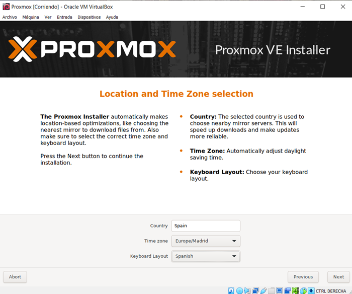
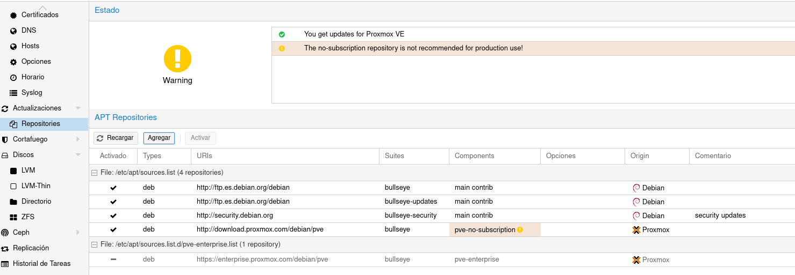

# INSTALACIÓN PROXMOX

- Creamos una máquina virtual en Oracle VM VirtualBox.
El sistemas operativo le indicaremos que será un Debian 11 Bullseye, pero es indiferente.
La imagen ISO que utilizaremos será la de Proxmox 7.4 Aquí esta el enlace de descarga de todas las imaganes, en mi caso se utilizaría la última versión estable: [Descargar imagen ISO](https://www.proxmox.com/en/downloads)
En memoria Ram le pondremos en mi caso 4GB para que vaya un poco más rápido.
Y por último tenemos que cambiarle la red, por defecto en esta en NAT, lo pondremos en adaptador puente, para que tenga salida a internet. 

**Muy importante!!**, tenemos que seleccionar por donde tendrá salida a internet si por Wifi o por cable, en mi caso es por Wifi, pero hay que tenerlo muy en cuenta porque si no puede dar problemas de red.

- Iniciamos la máquina.
Le damos a instalar.

Acaptamos los términos.

Ponemos la unidad del disco que queremos.

Seleccionamos el país, la zona horaria y el teclado.

Ponemos una contraseña y el correo electrónico.

Ponemos la interfaces, la ip, gateway y el dns del servidor.

En la siguiente imagen, vemos el resumen de todos lo que hemos configurado y le daremos a instalar.

Una vez que se haya instalado volverá a la pantalla de instalación de proxmox, en ese momento apagamos la máquina y le quitamos la ISO.

Una vez que tengamos instalado el proxmox y quitado la iso, ya podremos meternos desde el navegador a proxmox con su ip.

Tendremos que hacer un paso previo si queremos actualizar los paquetes.
Tenemos que irnos dentro de pve a Repositorios y quitar los repositorios que son de Enterprise, es decir, que se necesita licencia, sino lo quitamos no podrá actualizar nada, dará error todo el tiempo.
Le damos agregar y seleccionamos la opción de no-subscription.

Ahora arriba de Repositorios en Actualizaciones le damos a refrescar hasta que salga task ok.

En proxmox modo comando actualizaremos también con update y updagrade.

Ahora para que en proxmox se nos actualicen las plantillas y nos salgan unas cuantas más pondremos el siguiente comando.

Ahora veremos que hay una sección de plantillas de turnkey.

-----------------------------------------------------------------------------------------
#### LICENCIA

 Este obra está bajo una <a rel="license" href="http://creativecommons.org/licenses/by-sa/4.0/">licencia de Creative Commons Reconocimiento-CompartirIgual 4.0 Internacional</a>.

