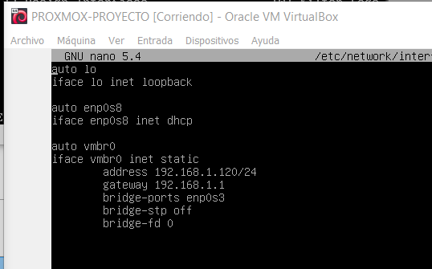
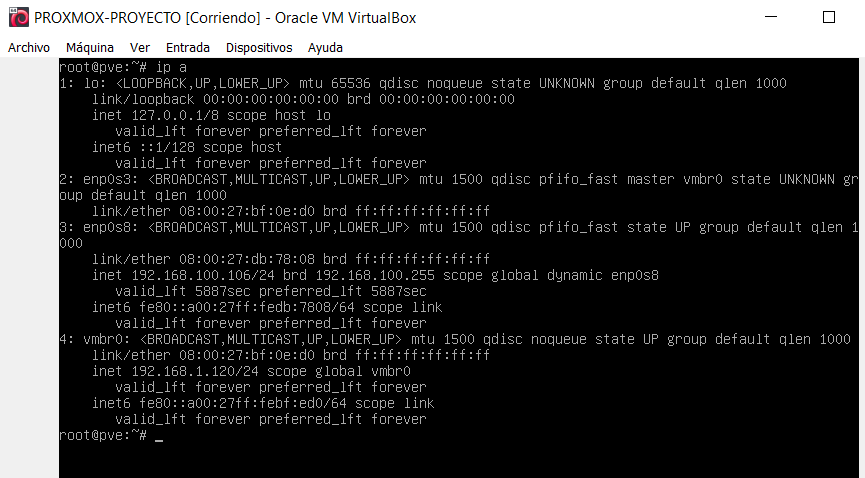
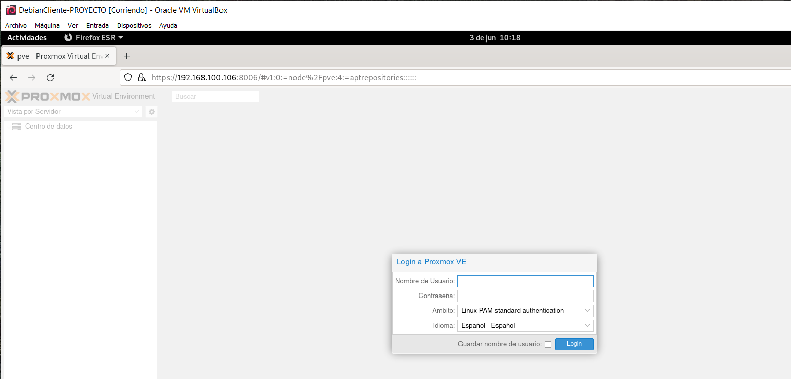

# INTEGRAR PROXMOX EN PFSENSE

Lo que tenemos que hacer es apagar el proxmox y añadir una tarjeta de red que está sea la de pfsense, en red interna.

Encendemos proxmox y hacemos ip a. En pricipio la tarjeta de red que hemos añadido saldrá como que está apagada (DOWN), la encedemos con el siguiente comando ip link set "nombre de la tarjeta de red" up, con esto ya estaría encendida. Pero eso no será suficiento, porque pfsense no tiene que dar una IP. Nos metemos en /etc/network/interfaces, ponemos la enp0s8 como dhcp. Reiniciamos y hacemos ip a.

Vemos que nos ha dado una ip del rango de ip que pusimos en la configuración de pfsense.

Ahora podemos entrar al proxmox desde una máquina virtual con la red de pfsense, es decir, hay más seguridad.

