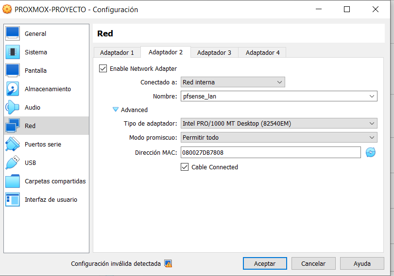

# INTEGRAR PROXMOX EN PFSENSE

Lo que tenemos que hacer es apagar el proxmox y añadir una tarjeta de red que está sea la de pfsense, en red interna.

Encendemos proxmox y hacemos ip a.

Veremos que tenemos que encender la tarjeta de red.

Pero eso no será suficiento, porque pfsense no tiene que dar una IP. Nos metemos en `/etc/network/interfaces`, ponemos la `enp0s8` como dhcp. Reiniciamos y hacemos ip a.

Vemos que nos ha dado una ip del rango de ip que pusimos en la configuración de pfsense.

Ahora podemos entrar al proxmox desde una máquina virtual con la red de pfsense, es decir, hay más seguridad.

PERO, también podremos entrar desde nuestra red a proxmox. (La ip para entrar a proxmox cambia dependiendo de donde quieras entrar, si desde pfsense, red 192.168.100.101:8006 o desde la máquina normal proxmox red 192.168.1.120:8006)

