# PFSENSE y OPENVPN

OpenVPN ya viene integrado en PFSENSE simplemente tendríamos que configurarlo.

Cuando accedemos a la página de PFSENSE através del cliente de debian, tendremos que irnos a System para crear los certificados.

 Le pondremos un nombre para el certificado, los demás campos se dejan como tal. En el apartado de Internal certificate Authority, lo único que cambiamos es el nombre del certificado, ponemos donde nos ubicamos que sería "ES", luego la ciudad y la provincia, podemos poner el nombre de la organización, pero también lo podemos dejar en blanco.
**IMPORTANTE!!**. En la sección Certificate Atribute, tenemos que seleccionar en el tipo de certificado el certificado de servidor, es el certificado que responderá el openvpn.
 
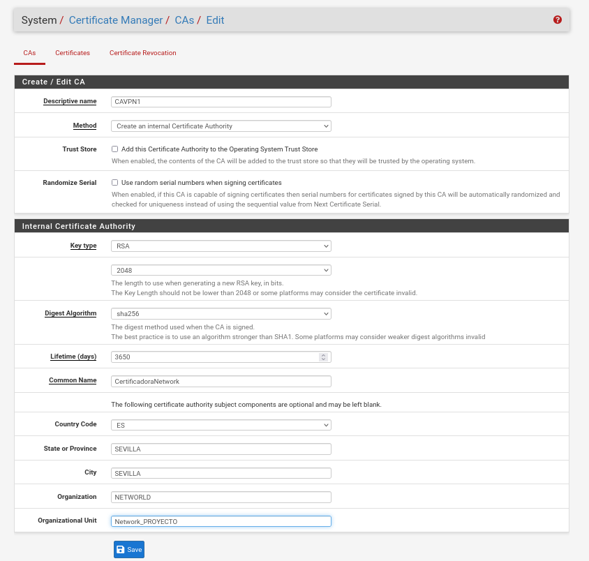

Una vez creada se verá así.

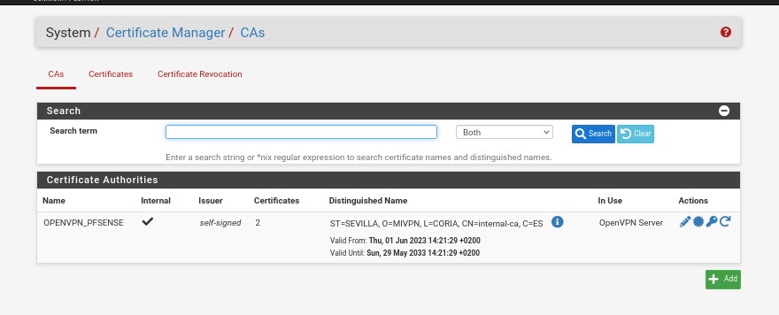

Ahora necesitaremos crear usuarios y sus certificados para poder entrar desde la red local a la red interna.
Nos metemos dentro de system en Users. Tenemos un usuario por defecto que es admin que no tendrá ningún acceso a la VPN, otro usuario para probar que es selene y crearemos uno nuevo. 
Le ponemos el nombre de usuario y su contraseña, le tenemos que dar click a la pestaña Certificate, se nos abrirá una nueva venta para crear el certificado del usuario, le tendremos que poner el nombre del certificado y la unidad certificadora es la que creamos antes.
(NOTA: Se pueden crear tanto usuarios como se quiera)

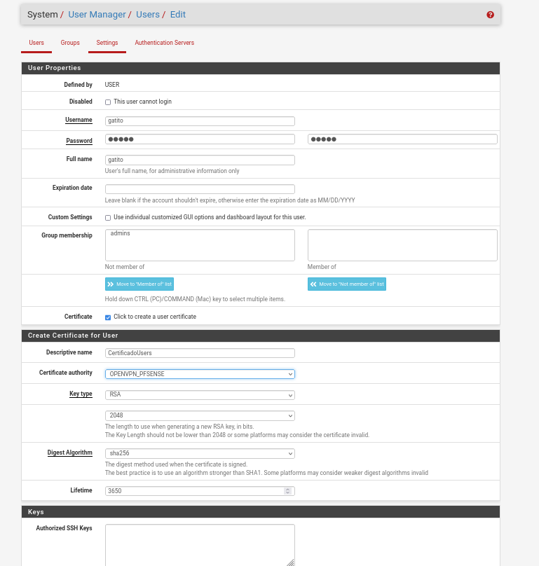

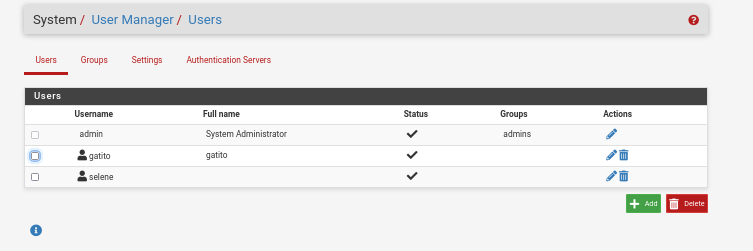

Ahora tenemos que crear una primera instancia para conectarla a OpenVPN. Nos metemos en VPN -> OpenVPN.

Crearemos una nueva:

Le ponemos una descripción opcional pero recomendable. En la pestaña de Mode Configuration, en la parte de server mode tenemos que poner como será la autenticación, que será através de certificados SSL y autenticación de usuario. Se usará el LocalDatabase donde se guardarán los usuario. 

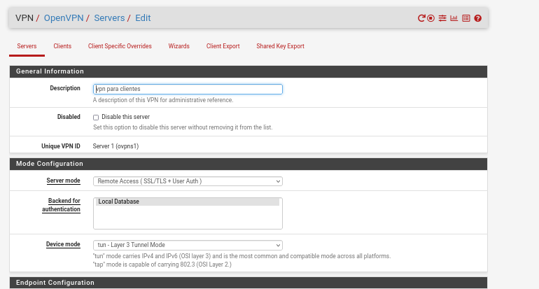

Se utilizará el protocolo UDP con su puerto 1194, si se necesita agregar mas intacias se irán aumentando el puerto.
En la parte Cryptographic Settings, tenemos que añadir el certificado del servidor que se creo antes.
Tenemos que quitar los algoritmos que viene por defecto para seleccionar los nuestros propios. Tenemos que marcar la casilla de Enforce key usage, lo que hace es forzar la autenticación de usuario que coincida con los usuarios.

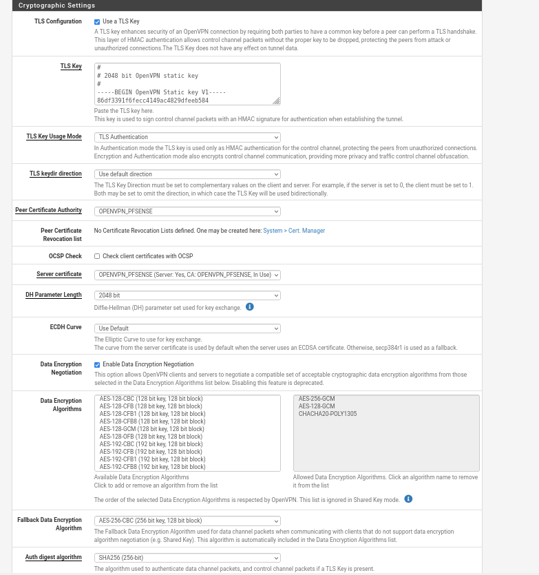

Crearemos el túnel, para conectarnos al servidor OPENVPN, la cuál nos asignará una direccion IP, esta direccin ip tendrá acceso total a la red interna.

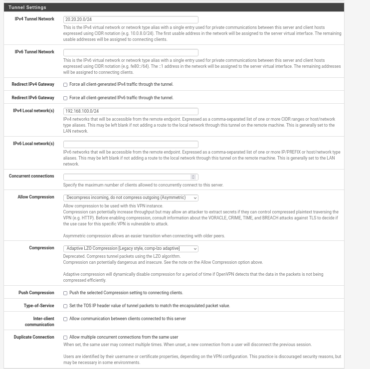

Podemos poner un máximo de conexión a la que pueden acceder a openvpn. Pero en mi caso lo dejaremos en blanco, serían un método más de seguridad.

Lo guardamos, ya tendríamos nuestro OpenVPN, funcionando correctamente.

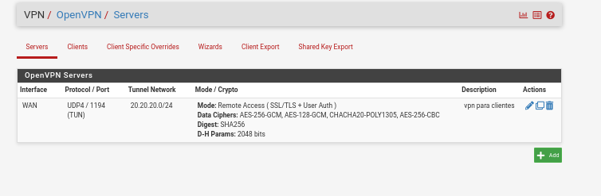

Tenemos que abrir el puerto del servidor OpenVPN, el puerto 1194.

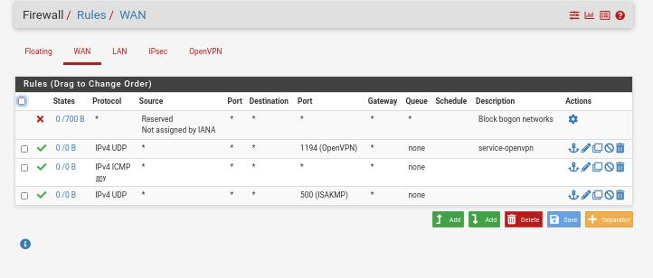

Aunque abramos el puerto seguriamos sin tener acceso a nada, aunque nos conectemos, porque esa regla todavía no la hemos añadido a OpenVPN.
En protocolo, lo dejamos en Any, es decir cualquier protocolo puede conectarse.

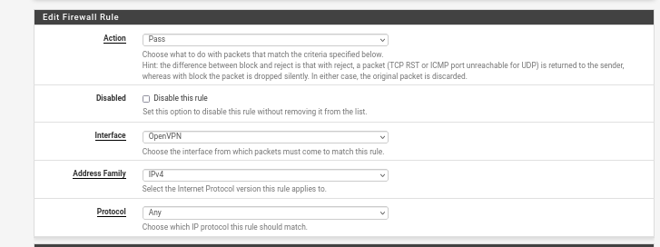

Hay que tener en cuenta que estas reglas permiten todo, se puede hacer mucho más seguro modificando estás reglas.

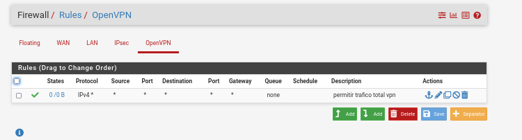

Necesitamos una aplicación para instalar nuestra configuración en todos nuestros ordenadores o incluso dispositivos móviles.
Para ello nos iremos a System -> Package Manager -> Available Packages, aquí tenemos que buscar openvpn-client-export. Una vez instalado nos iremos a la configuración de OPENVPN en VPN y veremos una nueva pestaña llamada Client Export.

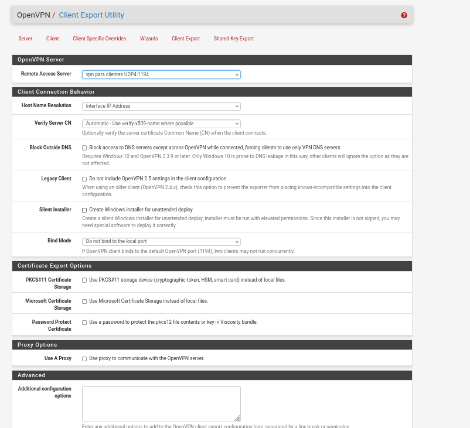

Todo los dejamos por defecto y pasamos directamente a la parte donde pone OPENVPN Clients.
En este apartado veremos los usuarios que tenemos creados y al lado de cada uno de lo usuarios tenemos unos botones que sirven para exportar la configuración que creamos o por ejemplo la aplicación ya compilada (Windows), aplicación ya tiene la configuración creada, lo usuarios simplemente lo instalará con sus credenciales.

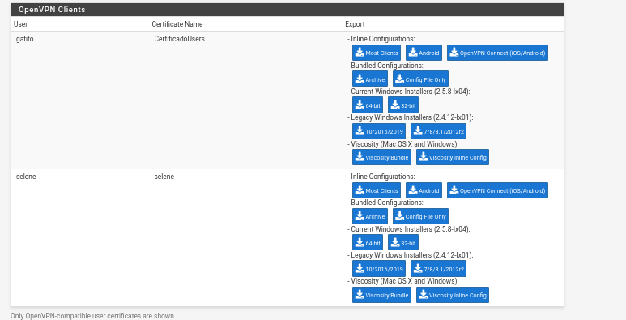

Ya tendríamos nuestra VPN creada. 
